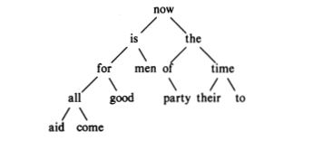

# 6. Structures
구조체란 하나의 이름으로 불릴 수 있는 서로 다른 타입의 변수들의 모임이다(PASCAL에서는 records). 구조체는 큰 프로그램에서 여러 변수들의 모임을 하나의 독립된 양으로 취급하게 해주므로 복잡한 자료를 다루는 것이 쉬워진다.

편히 생각하면 **객체**나 DB의 한 ROW라고 생각하면 되겠다.
## 6.1. Basics of Structures
**구조체 선언**
```c
struct point{
  int x;
  int y;
}
```
자바나 타입스크립트의 인터페이스 리터럴과 같다.

`struct`(type) : 명령어는 구조체의 시작을 나타낸다.  
`point`(name) : 구조체의 이름은 `struct` 뒤에 온다.  
`x,y`(member) :구조체에 속하는 변수들을 멤버라고 부르고 {}안에서 변수처럼 선언한다. 

멤버와 구조체의 이름은 엄밀히 구분되기 때문에 같은 이름이어도 상관없다. 또 구조체의 이름이 일종의 네임스페이스이기 때문에 동일한 멤버명을 다른 구조체에서 선언해도 문제없다.

**구조체 type의 선언과 구조체변수 선언**
```c
struct{...} x, y, z;
```
이렇게 하면 해당 구조(`{...}`)를 갖는 구조체를 3개(`x,y,z`) 선언한 것이다.

**구조체 type만 선언**
```c
struct{...};
```
이건 어따가 쓰는 걸까?

**선언된 구조체 type을 갖는 변수 선언**
```c
struct point pt
```
이렇게 되면 앞서 선언한 `point`의 구조와 같은 변수 `pt`가 만들어진다.


**선언된 구조체 type을 갖는 변수 선언과 할당**
```c
struct point pt = {320,200};
```

**구조체 멤버에 접근하는 법**
```c
pt.x; //320
pt.y; //200
```
`구조체이름.멤버이름`식으로 `.`이라는 멤버연산자를 이용해서 구조체의 이름과 멤버 이름을 연결시킨다.

**sqrt 무슨 문법이에요?**
```c
double dist, sqrt(double);
dist = sqrt((double)pt.x*pt.x+(double)pt.y*pt.y);
```

**구조체의 구조체도 있을 수 있다(객체안의 객체처럼)**
```c
struct rect{
  struct point pt1;
  struct point pt2;
}
```

**멤버로 구조체를 가지고 있는 구조체의 type을 갖는 변수와 접근**
```c
struct rect screen;
// screen의 pt1이라는 멤버의 x좌표는 다음과 같다.
screen.pt1.x;
```
## 6.2. Structures and Functions
구조체로 할 수 있는 연산은 Copy, Assignment, 그리고 &로 구조체의 주소를 리턴하는 것밖에 없다. Copy와 Assignment는 함수로 인자를 넘기거나 값을 받는 것을 포함해서 명칭하는 것이다.

구조체를 인자로 받아 연산을 하는 함수를 사용해보자. 최소 세가지 접근 방법이 있다.
1. 독립적으로 요소를 보내거나(`sqrt(pt.x)`)
2. 하나의 구조체를 보내거나(`sqrt(pt)`)
3. 포인터로 보내는 방법(`sqrt(&pt)`)

### 두개의 정수를 받아 point라는 구조체 리턴
```c
struct point makepoint(int x, int y){
  struct point temp;
  temp.x = x;
  temp.y = y;
  return temp;  
}
```
`makepoint`는 어떠한 구조체의 초기화나 멤버에 어떤 값을 넣는 함수로 사용할 수 있다.

### 함수를 통해 구조체의 초기화, 멤버에 값 할당
```c
struct rect screen; // point 형 구조체 두개를 가지고 있는 rect형 변수 sreen 선언
struct point middle; // point 형 구조체 middle 선언
struct point makepoint(int,int); // point 구조체를 리턴하고 int 2개 를 인자로 받는 makepoint선언

screen.pt1 = makepoint(0,0); // 구조체 pt1의 멤버 값을 함수를 통해 할당 pt.x=0, pt.y=0
screen.pt2 = makepoint(XMAX,YMAX);
middle = makepoint((screen.pt1.x+screen.pt2.x)/2,(screen.pt1.y + screen.pt2.y)/2);
// middle 이라는 point 타입 구조체에 makepoint함수를 통해 멤버값 초기화.
```

### 구조체를 매개변수로 받는 함수
```c
struct point addpoint(struct point p1, struct point p2){
  p1.x += p2.x;
  p1.y += p2.y;
  return p1;
}
```
여기서는 구조체를 매개변수로 받고 구조체를 리턴해준다.

### 매개변수로 구조체와 구조체를 멤버로갖는 구조체를 받는 함수
```c
// rect라는 사각형안에 point가 들어가 있으면 1 아니면 0을 리턴하는 함수
// 왼쪽과 밑변은 사각형 영역에 포함하고 오른쪽과 윗변은 포함되지 않는다고 가정
// pt1이 왼쪽 아래에 있는 점의 좌표다.
// pt2가 오른쪽 위에 있는 점의 좌표다.
int ptinrect(struct point p, struct rect r){
  return p.x>=r.pt1.x && p.x < r.pt2.x && p.y >= r.pt1.y && p.y < r.pt2.y;
}
```
그런데 사람에 따라서 왼쪽 아래에 있는점을 `pt2`로 넣을 수도 있으니 `rect`형 변수를 받아서 왼쪽 아래의 점을 `pt1`으로 넣는, 일종의 표준화 함수를 만들어보자.

### 표준화(canonical) 함수
```c
struct rect cononrect(struct rect r){
  struct rect temp;
  
  temp.pt1.x = min(r.pt1.x, r.pt2.x);
  // 이런식으로 두 점중 더 작은 x의 좌표 즉, 왼쪽아래에 있는 점의 x좌표를
  // 새로운 rect변수의 pt1에 담는다. 나머지도 마찬가지.
  ...
}
```

### 구조체의 포인터
구조체의 포인터는 일반적인 방식과 같다.
```c
struct point *pp
```
헷갈릴 수도 있으니 정리하고 가자. `pp`는 포인터이고(`*`) 해당 포인터가 가리키는 주소의 실제 값은 `point`라는 형을 가진 구조체이다.

`pp`를 사용하기 위해서는 다음과 같이 일종의 더미변수를 만들어줘서 포인터에 할당을 해줘야한다.
```c
struct point dummy, *pp;

pp = &dummy;
// 이렇게 해야만 포인터가 실제 메모리 공간을 가리킬 수 있게 되고 *pp로 값을 이용할 수 있게 된다.
printf("origin is (%d,%d)\n", (*pp).x, (*pp).y);
```

### 포인터로부터 구조체 멤버의 접근
```c
p->멤버
```
만약 `p`가 포인터라면 `->`연산자를 통해서 `(*p).멤버`와 같은 효과로 `p->멤버`를 쓸 수 있다.

그래서 다음과 같이 활용할 수 있다.
```c
struct rect r, *rp = &r;
// 여기서 rp는 포인터이며 r의 주소를 담고 있다.
// 포인터에 할당하는 것은 변수여야 해서 따로 더미 변수 r을 선언해준 것이다.
r.pt1.x;
rp->pt1.x;
(*rp).pt1.x;
// 위 세가지는 모두 같은 표현이다.
```

구조체 연산자 `.`, `->`는 함수를 부르기 위한 `()`, 인덱싱을 위한 `[]`과 함께 **우선순위가 가장 높은 연산자이다.**

그래서
```c
struct {int len; char *str;} *p;
```
와 같은 선언이 있으면 `++p->len`는 `++(p->len)`과 같은 의미이므로 p가 가리키는 주소의 구조체의 멤버 len을 1증가 시킨다.

`*p->str` 은 사실상 `*(p->str)`이므로 str이라는 멤버가 가지고 있는 값을 의미한다.

## 6.3. Arrays of Structure
포인터로 이루어진 배열이 있듯 구조체로 이루어진 배열도 있다.

문자열 `C`에서 사용되는 키워드중 어느 것이 몇 번 나왔는지 세는 프로그램을 생각해 보자.
이 프로그램에는 이름을 나타내는 문자열의 배열과 그 수를 세기 위한 정수의 배열이 필요하다. 그 한가지 방법은 keyword와 keycount 라는 두개의 배열을 사용하는 것이다.
```c
char *keyword[NKEYS];
int keycount[NKEYS];
```
아니면 두 개의 배열 대신 구조체를 사용하는 것이 가능하다.

### 구조체로 이루어진 배열 선언
```c
struct key{
  char *word;
  int count;
} keytab[NKEYS];
```
의미를 보면 `key`라는 구조체를 원소로 갖는 길이 `NKEYS`의 배열 `keytab`을 만든 것이다.
그렇다. 구조체로 이루어진 배열을 만들었다.

배열의 선언이 다음과 같았음을 떠올리면 아구가 맞다.
```c
배열원소의데이터타입 배열의이름[배열의크기]
```

### 구조체 배열의 선언과 동시에 할당
```c
struct key{
  char *word;
  int count;
} keytab[] = {
  "auto", 0,
  "break", 0,
};
```
아니면 좀 더 시각적으로 잘 보이게 이렇게 구조체 단위로 묶을 수도 있다.
```c
struct key{
  char *word;
  int count;
} keytab[] = {
  {"auto", 0},
  {"break", 0},
};
```

### 본격 키워드 세는 프로그램 작성
```c
#include <stdio.h>
#include <ctype.h>
#include <string.h>

#define MAXWORD 100

int getword(char *, int);
// 이 함수는 단어를 입력받아 그 단어를 첫 번째 매개변수인 배열에 복사한다.
int binsearch(char *, struct key *, int);
// 이 함수는 배열 내 원소가 오름차순으로 정렬되어 있을 때 이진탐색으로 중간 값의
// 결과에 따라 왼쪽 절반으로, 혹은 오른쪽 절반으로 나눠가면서 주어진 값을 찾는 함수이다.\
// 값을 찾으면 값의 인덱스를 반환하고 찾지 못하면 -1을 리턴한다.
// O(logn)의 복잡도를 가진다.
main(){
  int n;
  char word[MAXWORD];
  while(getword(word,MAXWORD) != EOF)
    // 입력 받은 문자가 끝타기 전까지 word에 저장한다.
    if(isalpha(word[0]))
      // 첫 문자가 알파벳이면
      if((n=binsearch(word,keytab,NKEYS))>=0)
        // 해당 문자열에서 keytab의 word를 찾고, 있으면
        keytab[n].count++;
        // 해당 키탭의 coutn 를 증가 시킨다.
  for(n = 0; n < NKEYS; n++)
    if(keytab[n].count > 0)
      print("%4d %s\n", keytab[n].count, keytab[n].word);
      // 카운팅이 끝나면 keytab 배열의 구조체들을 돌며 카운트가 0보다 큰
      // 녀석들의 단어와 카운트를 프린팅해준다.
  return 0;
}
```

키워드 수는 배열의 size(용량)를 원소인 구조체의 size(용량)으로 나눈 것과 같다.
이를 통해 define문에서 NKEYS 즉 키워드의 개수를 정할 수 있다.
```c
#define NKEYS ((sizof keytab) / sizeof(struct key))
```
또는
```c
#define NKEYS ((sizof keytab) / (sizeof keytab[0]))
```

## 6.4. Pointers to Structures
이번엔 문자열 C의 키워드 중 어떤 것이 몇 번 나왔는지 세는 프로그램을 다시 작성해보자.
단 배열의 인덱스 대신 포인터를 쓰기로 한다. `main`과 `binsearch`를 조금 수정한다.
```c
#include <stdio.h>
#include <ctype.h>
#include <string.h>
#define MAXWORD 100

int getword(char *, int);
struct key *binsearch(char *, struct key *, int);
// 이번엔 binsearch가 key형의 구조체 값을 가리키는 포인터를 반환한다.
main(){
  char word[MAXWORD];
  struct key *p;
  // key형의 구조체를 갖는 값을 가리키는 포인터 p 선언
  while(getword(word,MAXWORD) != EOF)
    if(isalpha(word[0]))
      if((p=binsearch(word,keytab,NKEYS))!=NULL)
        p->count++;
        // 여기서 p는 keytab[n]의 포인터로 쓰였다.
  for(p=keytab; p < keytab + NKEYS; p++)
    if(p->count > 0)
      print("%4d %s\n", p->count, p->word);
  return 0;
}
```

## 6.5. Self-referential Structures
이번엔 어떠한 입력에서 발생할 수 있는 모든 단어의 발생횟수를 셀 수 있는 좀 더 일반적인 문제를 푸는 함수를 작성해보자. 단어의 목록을 미리 알 수 없기 때문에 쉽게 정렬시켜 이진탐색을 사용할 수가 없다. 또한 단어가 나올 때 마다 그 단어가 이미 나타났던 것인지를 알기 위해 모든 단어를 뒤져볼 수도 없다. 프로그램이 너무 느려지기 때문이다(**O(n<sup>2</sup>)** 의 복잡도를 갖는다).

한가지 해결 방법은 새로운 단어가 들어올 때마다 적당한 위치에 그 단어를 넣음으로써 들어온 단어들을 항상 정렬시켜 두는 것이다. 이것을 위해 이진트리(binary tree)라고 불리는 자료구조를 사용해본다.

트리는 서로 다른 각 단어마다 하나의 노드(node)를 갖는데 각 노드는 다음과 같은 정보를 갖는다.

- 단어의 포인터
- 발견된 횟수
- 왼쪽 자식노드에 대한 포인터
- 오른쪽 자식노드에 대한 포인터

어떤 노드도 2개를 넘는 자식노드를 가질 수 없다. 자식노드는 0과 1로 표현된다. 각 부무노드의 왼쪽 자식노드는 부모노드보다 작은 값을 갖는 노드만이 있고 오른쪽 자식노드에는 부모노드보다 큰 값을 갖는 노드만 오게 된다. 여기서 값의 비교는 단어의 사전식 순서로 삼았다(다른 방식의 데이터를 다룰 때 비교할 값은 달라질 것이다).

"now is the time for all good men to come to the aid of their party"라는 문장으로부터 정렬된 이진트리는 다음과 같다.

<p style="text-align:center;"></p>

새로운 단어가 그 트리에 있나 없나를 알기 위해서는 가장 위의 노드부터 시작하여 그 노드에 저장된 것과 새로운 단어를 비교한다. 두 단어가 일치하면 그 단어는 트리에 있는 것이고, 만약 그 단어가 노드의 단어보다 작으면 왼쪽 자식 노드와 비교하고 그렇지 않으면 오른쪽 자식 노드와 비교한다. 비교된 방향으로 맞는 단어가 없으면 새로운 단어는 트리에 없는 것이고 새로운 단어를 추가하기 위해 적당한 빈 공간이 마련된다. 이러한 탐색은 어떠한 노드에 일치하지 않으면 그 자식 노드에 대해 똑같은 과정을 하게 되므로 recursive한 과정이 된다. 각 노드를 다시 살펴보면 다음 네 개의 요소로 구성되어 있다.
```c
struct tnode{
  char *word;
  int count;
  struct tnode *left;
  struct tnode *right;
}
```
이렇게 노드를 순환적으로 선언하는것이 이상하게 보이지만, 사실 자기 자신을 포함하게 되는 것은 오류가 될테지만 tnode의 포인터 값을 가지는 것이므로 문제가 없다.

이제 프로그램을보자
### Binary tree generator
```c
#include <stdio.h>
#include <ctype.h>
#include <string.h>
#define MAXWORD 100

struct tnode *addtree(struct tnode *, char *);
// 루트노드의 포인터와 문자배열을 받아 트리에 문자를 삽입한 후 다시 트리의 포인터를 반환한다.
void treeprint(struct tnode *);
// 노드의 포인터를 받아서 트리를 출력해주는 함수다.
int getword(char *, int);
// 이 함수는 단어를 입력받아 그 단어를 첫 번째 매개변수인 배열에 복사한다.

main(){
  struct tnode *root;
  char word[MAXWORD];
  root = NULL;
  while (getword(word,MAXWORD) != EOF)
    if(isalpha(word[0]))
      root = addtree(root,word);
  treeprint(root);
  return 0;
}
```
`addtree`루틴은 순환적이다. main에서 읽어 들인 한 단어는 트리의 맨 위에 놓인다. 각 단계마다 그 단어는 그 노드에 있는 단어와 비교되어서 결과에 따라 왼쪽이나 오른쪽 자식노드로 가서 트리를 순환적으로 호출하게 된다.

결국 그 단어는 그 트리에 있는 어떤 단어와 일치해서 카운트를 하나 증가시키든지 또는 일치하지 않아서 null포인터를 만나 그 노드가 트리에 첨가되어야 함을 나타내게 된다. 만일 새로운 노드가 만들어지면 addtree는 그 노드에 대한 포인터를 리턴시키고 그 포인터를 해당되는 바로 위의 부모노드에 기록한다.

### addtree function
```c
struct tnode *talloc(void);
char *strdup(char *);
// addtree : 단어 w의 노드를 p에 혹은 p의 밑에 추가시키는 함수
struct tnode *addtree(struct tnode *p, char *w){
  int cond;
  if(p == NULL){
    // p가 없을 경우 새로운 노드를 만든다.
    p = talloc();
    p->word = strdup(w);
    p->count = 1;
    p->left = p->right = NULL;
  }else if((cond = strcmp(w,p->word)) == 0){
    // p가 있고, 두 단어를 비교했을 때 정확히 같은 단어라면 카운트를 증가시킨다.
    p->count++;
  }else if(cond<0){
    // 더 값이 작은 단어라면(즉 사전식으로 앞에 있는 단어라면)
    // 왼쪽 자식노드로 가서 addtree를 다시 한다.
    // 이 식은 재귀적이기 때문에 적절한 위치를 만날 때 까지 계속 밑으로 내려갈 수 있다.
    p->left = addtree(p->left,w);
  }else{
    // 반대로 값이 더 크다면 오른족 자식노드로가서 addtree를 한다.
    p->right = addtree(p->right,w);
  }
  return p;
  // 최종적으로 변경된 노드(값이 크거나 작았다면 새로운 노드가 삽입된 부모노드)
  // 의 포인터 p를 반환한다.
}
```
새로운 노드에 대한 기억장소는 노드를 기억할 수 있는 적당한 기억공간에 대한 포인터를 리턴시키는 talloc이라는 함수에 의해 배당된다(아마도 `struct tnode dummy, *p = &dummy; return p;`)식이 될거 같다).

strdup에 의해 새로운 단어는 숨겨진 장소로 복사된다. 카운터는 초기화되고 두 개의 자식노드는 NULL값을 갖게 된다. 이 부분은 위에서 볼수있듯 새로운 노드가 추가될 때만 실행된다. 

treenode는 정렬된 순서로 트리를 출력한다. 각각의 마디에서 먼저 왼쪽 자식노드를 출력한 후 그 단어를 출력하고 다음에 오른쪽 자식노드를 출력한다.
### treeprint
```c
void treeprint(struct tnode *p){
  if(p!=NULL){
    treeprint(p->left);
    printf("%4d %s\n", p->count, p->word);
    treeprint(p->right);
  }
}
```
### talloc
```c
struct tnode *talloc(void){
  return (struct tnode *) malloc(sizeof(struct tnode));
}
```
### strdup
```c
char *strdup(char *s){
  char *p;
  p = (char *) malloc(strlen(s)+1);
  if(p != NULL){
    strcpy(p, s);
  }
  return p;
}
```