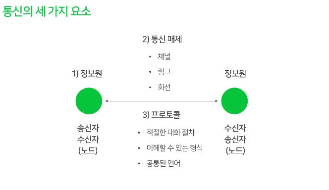
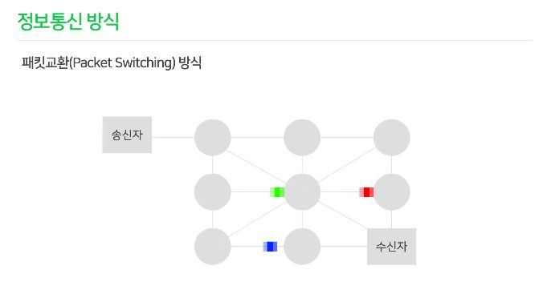
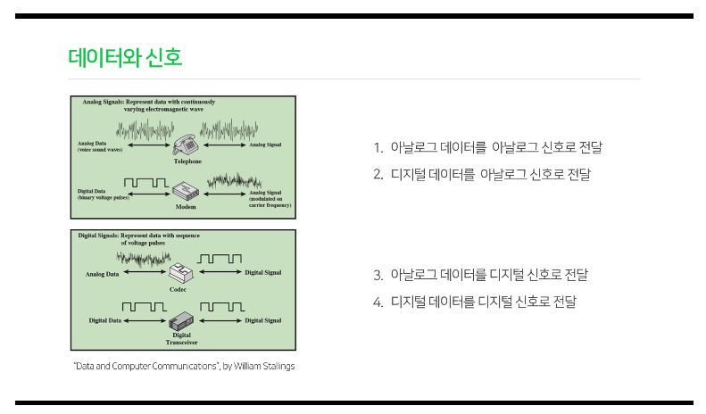
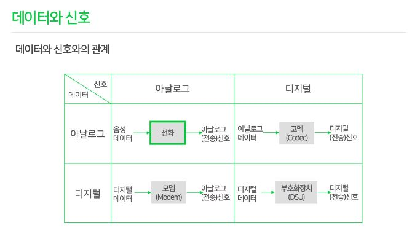
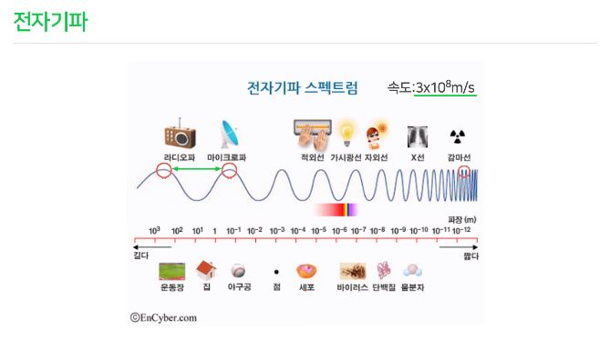
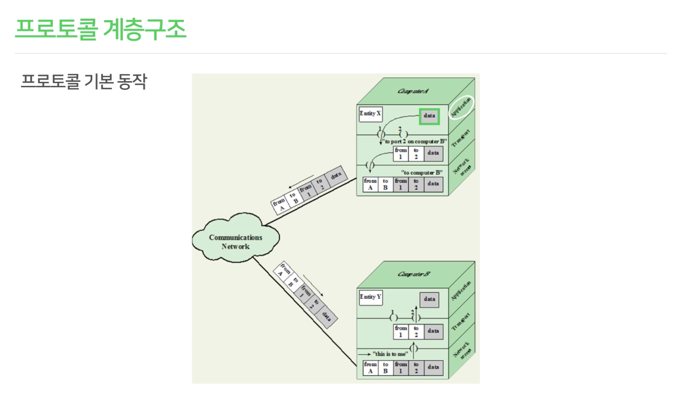
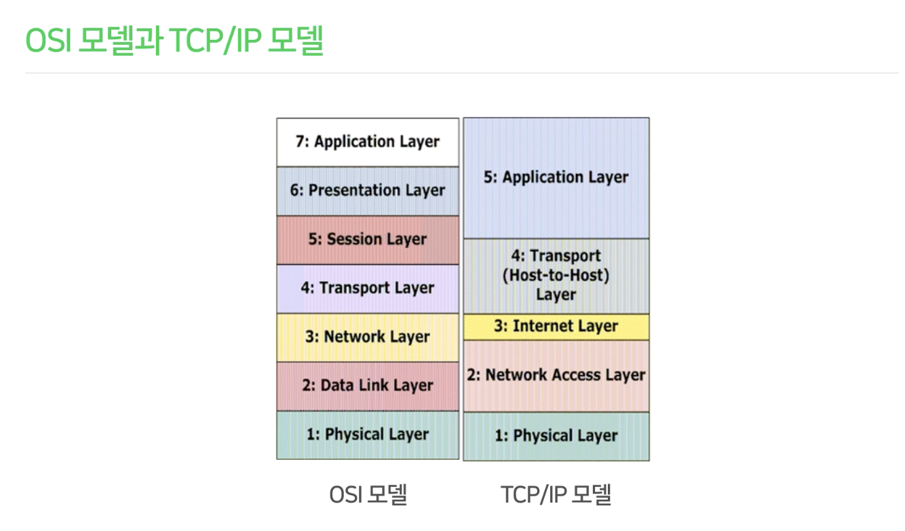
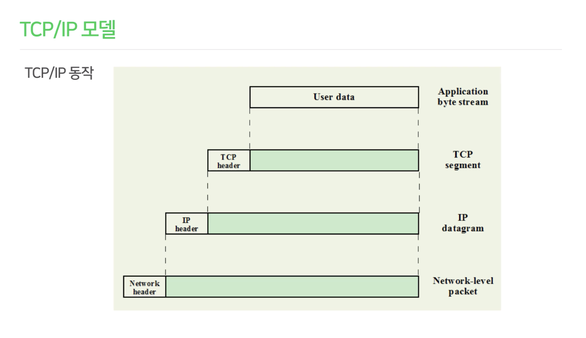
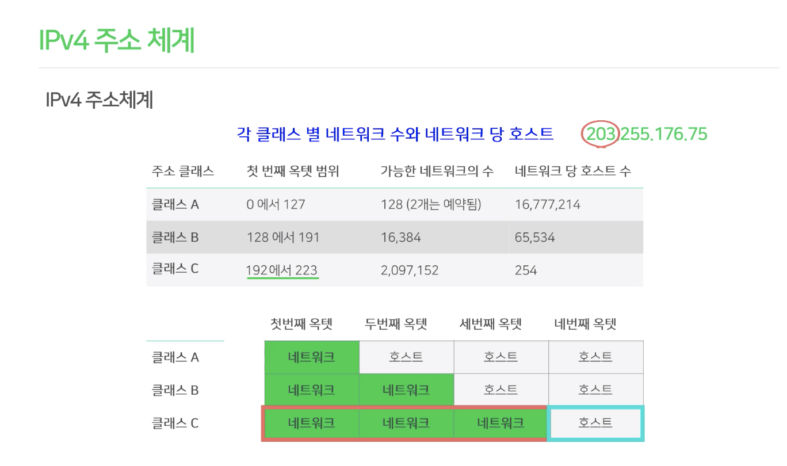

# 통신의 기초
출처 : [edwith 통신의 기초 강의](https://www.edwith.org/tel-ewha-course)

## 1강 통신이란?
우리나라가 IT강국이라고 하는데 IT란 Information Technology 정보기술을 의미한다. 

최근에는 ICT라는 말이 많아졌는데 이는 Information Communication Technology 즉, 정보통신기술이다. 그만큼 독립적으로 떨어진 한 컴퓨터에서 행하는 일보다 통신을 하며 이루어지는 일이 훨씬 중요한 것이 되었다.

통신이란?
- 통신 : 정보나 의사를 주고 받음. 사람 또는 기계들 간에 **다양한 매체**를 이용 정보를 전달.
- 통신의 목적 : 자신의 의사를 **정확히** 전달하는 것

따라서 통신은 다음 세가지 요소가 꼭 필요하다.



1. 정보원 : 송신자, 수신자
2. 통신매체 : 채널, 링크, 회선
3. 프로토콜 : 적절한 대화절차, 약속된 형식, 공통된 언어
## 2강 정보통신의 의미
### 정보통신의 의미
- 데이터(data) : 가공되지 않은 자료
- 정보(information) : 우리 생활 주변에 산재되어있는 데이터들을 수집 가공처리하여 사용목적에 따라 잘 정돈한 유용한 상태
- 통신(communication) : 사람 또는 기계들 간에 **다양한 매체**를 이용 정보를 전달
- 정보통신 : 정보 전송기술과 컴퓨터에 의한 정보의 처리 기능을 결합한 것
### 정보통신의 개요
우리나라에서 정보통신은 1960년대 전신과 전화의 형태로 시작되었다. 1970년대 데이터 통신, 컴퓨터 통신, 팩스 통신이 등장했다

### 정보통신의 형태
- 단방향통신 : 방송, 라디오, 이메일 등 한쪽으로만 정보가 전달되는 형태
- 양방향통신 : 전화와 같이 통신기기가 서로 정보를 주고받을 수 있는 교신 형태 여기서 또 두개로 나뉜다.
  - 전이중(Full duplex) : 전화처럼 송신 수신이 동시에 되는 것.
  - 반이중(Half duplex) : 무전기처럼 한번에 한쪽 방향으로 밖에 못가는 것.

## 3강 정보통신의 방식

1. 회선교환(Circuit Switching)방식
    - 통신 기간 동안 독점적인 사용을 위해 두 통신 노드 사이를 연결.
    - 즉 두 노드가 연결되면 해당 path는 점유가 되어버려 다른 사람들은 사용을 못함.
2. 패킷교환(Packet Switching)방식
    - 작은 블록의 패킷으로 데이터 전송
    - 데이터를 전송하는 동안만 네트워크 자원을 사용하기 때문에 이용률이 높다!
    - 네트워크 연결 사으이 모든 노드들 사이에 개별적으로 경로가 제어되고 회선을 공유함
    - 각 패킷은 서로 다른 경로를 통해 전달될 수 있고 도착해서 다시 정렬된다.
    - 현재 가장 많이 사용되는 통신 방식이다.



## 4강 데이터와 신호

- 데이터(Data) : 자료
- 정보(Information) : 데이터를 가공 처리(Processing)한 것
- 신호(Signal) : 상대방한테 전달하기 위해서 정보를 변환한 것  

예를 들어 생일 축하를 상대방한테 전달하려면 음향, 텍스트, 이미지, 비디오등 여러가지 정보 혹은 데이터 타입을 전송 매체를 통해 신호로 바꾸어야 한다.

### 데이터의 두가지 종류
1. 아날로그 데이터
2. 디지털 데이터

### 신호의 두가지 종류
1. 아날로그 신호
    - 어떤 양 또는 데이터를 연속적으로 변화하는 물리량으로 표현
    - 곡선 형태로 전달
2. 디지털 신호
    - 어떤 양 또는 데이터를 2진수의 조합으로 표현하는 것
    - 1 또는 0 이라는 숫자로 전달(이산적으로 전달)

### 데이터가 신호로 바뀌는 경우 네가지


데이터도 두가지 신호도 두가지가 있으니 조합하면 4가지 형태가 존재한다.

1. 아날로그 데이터 -> 아날로그 신호 : 유선 전화기
2. 디지털 데이터 -> 아날로그 신호 : 통신망이 구축되지 않은 초기에는 유선 망을 사용 했었는데 이 때 등장한 것이 모뎀이다. 모뎀은 Modulation 과 De-modulation을 합쳐 부르는 건데 컴퓨터에서 생성되는 디지털 신호를 유선 전화망을 통해 아날로그 신호로 전달하고 그것을 다시 디지털화 시키는 장치이다.
3. 아날로그 데이터 -> 디지털 신호 : 대표적으로 코덱이라는 장비가 있다. 이를테면 영상이나 소리를 녹화/녹음할 때 아날로그 데이터를 디지털 신호로 바꾸어주는 것이 코덱이다.
4. 디지털 데이터 -> 디지털 신호 : 우리가 가장 많이 사용하는 것. 요즘 우리가 사용하는 인터넷 통신.



## 5강 통신망의 종류
통신망을 분류하는 기준엔 여러가지가 있지만 가장 많이 쓰이는 기준은 **규모**에 따른 분류이다.
### 1. LAN(Local Area Network)
같은 조직안에 있는 컴퓨터들 끼리 연결하자는 목적으로 만들어졌다(그 때는 플로피 디스크로 서로 공유했어야 하는데 이건 용량도 작고 번거롭고 귀찮았으니까).
- 우리말로 하면 근거리 통신망이다.
- 수미터에서 수킬로미터 반경의 망이다.
- 전송매체는 전화선, 동축케이블, 광섬유 등이 있다.
### 2. MAN(Metropolitan Area Network)
LAN이 도시규모로 확장된 것이 MAN이다.
### 3. WAN(Wide Area Network)
이런 LAN, MAN을 전세계적으로 연결 시킨 것이 WAN이다.
- 공중망(public network)을 이용한다.
- 수백, 수천 킬로미터의 거리를 연결한다.
- 국가 간, 대륙 간 전 세계 네트워크 망

그런데 이렇게 확장되니 서로 다른 컴퓨터 시스템 간의 연결, 장거리 데이터 전송, 효과적 네트워크 관리, 위성 및 케이블을 통한 대륙 간 연결 등의 고급기술이 필요했다.

이러한 문제를 해결 하기 위해 **통신 프로토콜**이 생겼다.

## 6강 전자기파


전자기파는 전기와 자기를 합친 이름이다. 전기가 자기를 유도하고 자기가 전기를 유도하는 것은 우리가 초중고등학교 때 배웠던 사실이다. 파장이 길든 짧든 같은 파동이므로 속도가 같다.

빛도 전자기파의 일부이다(즉, 가시광선도 통신을 위해 쓰일 수 있다! 색깔이 다른 빛을 쏴주고 그 빛을 통해 정보를 읽는 통신 예시를 박물간 따위에서 보여주면 재밌을듯!).

전자기파가 중요한 이유는 우리의 신호가 전자기파를 통해서 전송되기 때문이다.

### 정보용량
- bit : 0 또는 1의 한자리 즉 두가지 정보를 표현 가능
- byte : 8bit를 묶은 단위
- KB(kilo Byte) : 2<sup>10</sup> byte
- MB(Mega Byte) : 2<sup>20</sup> byte
- GB(Giga Byte) : 2<sup>30</sup> byte
- TB(Tera Byte) : 2<sup>40</sup> byte

## 7강 전송매체
신호를 전달하는 매개체가 전송매체이다. 전송매체에는 유선매체 무선매체가 있다.
1. 유선매체
    - 꼬임상선(Twisted Pair) : 가장 많이 쓰이고 단순한 매체, 유선전화망에 쓰였고 저렴함. 효율성은 많이 떨어짐.
    - 동축 케이블(Coaxial Cable) : 폭넓은 주파수 범위를 허용. 장거리 전화망, 유선TV, 근거리 통신망에 많이 쓰여왔음.
    - 광섬유(Fiber Optics) : 보통 플라스틱이나 유리 섬유로 만들어져 있다. 넓은 대역폭, 빠른 속도, 높은 보안성을 제공한다. 최근에는 높았던 비용도 많이 저렴해졌다. 
2. 무선매체
    - 라디오파 : 단방향 무선통신, AM/FM라디오
    - 지상 마이크로파 : 2~40GHz이용, 포물선 모양의 접시형 안테나를 이용하는 무선통신. 방향성을 가진 직진성 무선 전송. 높은 곳에 전송탑 설치. TV, 셀룰러 통신, 무선LAN
    - 위성 마이크로파 : 통신 위성을 중계국으로 사용한다. 전파의 수신이 조금 지연된다. 전송된 전파는 위성 안테나를 통해 모든 지상에서 수신 가능.
    - 적외선 : 단거리 통신, 방향성을 가지면서 저렴하다. 리모콘!

위성 통신을 통해 우리는 장거리 전화나 GPS, TV 생중계 등을 이용할 수 있다. 

### 정지 위성
지구의 자존과 동기시켜 지상에서 보았을 때 항상 그자리에 있는 거처럼 보이는 위성. 

### GPS (Global Positioning System)
위성위치 확인 시스템. 수십개의 인공위성을 이용한다. 인공위성들이 주기적으로 동시에 송신하면 기기가 위성신호를 포착해서 다시 위성들에게 신호를 보내고, 도착한 여러 개의 신호를 이용해서 기기의 위치를 계산하는 방식이다.

## 8강 프로토콜이란?
### 프로토콜 
프로토콜은 통신회선을 이용해서 컴퓨터간, 컴퓨터와 단말기사이에 데이터를 주고 받는 방식을 어떻게 할 건지 정해놓은 약속이다.

이를 통해 통신을 원하는 두 entity간 무엇을, 어떻게, 언제 통신할 것인가를 서로 약속하여 통신상의 오류를 피하도록 하게 하는 통신규약이다.

간단한 예시로 과거에 우리는 의사전달을 위해 봉화대를 썼었다. 낮에는 연기로 밤에는 불빛으로 소식을 전달한다. 나팔이나 북도 통신수단이었다. 불을 몇개를 지피는가, 나팔을 몇번 부는가, 북을 어떤 장단으로 치는가에 따라 통용되는 의미가 다를 것이다. 즉 나름의 프로토콜을 가지고 있었다.

### 프로토콜의 3요소
1. 구문(Syntax) : 데이터 블록의 형식(format), 이 형식을 맞추고 상호간에 통신을 하자는 것. 이를테면 봉화대의 개수
2. 의미(Semantics) : 상호작용, 오류 제어 등을 위한 제어정보. 해당 포맷에 어떤 것을 담을 때 담아 놓은 것이 어떤 의미인지에 대한 약속. 이를테면 봉화대를 몇개 켜는게 무슨의미인지 에 대한 약속.
3. 동기(Timing) : 속도, 순서 등을 상호 간에 맞춤.

### 통신 프로토콜의 기능
1. 동기제어 (Synchronization)
2. 분리와 재결합(긴 데이터를 패킷으로의 분리, 원래 데이터로 재결합)
3. 흐름 제어(Flow Control) : 초당 처리 할 수 있는 양보다 더 많은 패킷이 들어올 때 overflow가 되지 않게 흐름을 제어한다는 뜻이다.
4. 순서 제어(도착한 패킷의 순서) : 따로 분리된 패킷을 조합할 때 다시 순서대로 맞추는 것
5. 주소 지정(IP Address) : sender와 receiver의 주소를 적어 보내는 것.
6. 오류 제어 : 원래 데이터가 변경이 되었다면 어떻게 처리할 것인지
7. 경로 제어(Routing) : 패킷이 보내는 쪽에서 받는 쪽까지 갈 때 수많은 경로중에 가장 좋은 경로를 선택하거나, 중간 경로가 문제가 있을 경우 어떤 경로로 우회할지를 제어할 수 있는 것
8. 캡슐화(Encapsulation) : 데이터 조각을 제어 정보를 붙이는 과정을 캡슐화라 한다.

## 9강 프로토콜 계층구조
- 프로토콜은 하드웨어, 소프트웨어로 계층적으로 나누어져 구성되어있다.
- 로직(수행하는 일)에 따라 세부 모듈로 나누어 별도 계층으로 구현한다.
- 각 계층은 전체 기능의 작은 부분만을 수행한다.
- 하위계층은 상위계층에 서비스를 제공
- 상위계층은 하위계층을 **기반으로 수행**(하위계층 서비스를 이용)
- 한계층의 변화가 다른 계층에 영향을 미치지 않는다.(계층별 역할과 프로세스를 한정시켜놨기 때문에)

### 3계층으로 알아본 프로토콜 계층 구조


3계층으로 예시를 들어서 프로토콜의 계층구조를 살펴보자.

한 컴퓨터 A에서 컴퓨터 B에게 메일을 보낼 때의 과정을 보자.
1. A에서 사용자는 메일을 작성하는 애플리케이션을 실행시킨다.
2. 애플리케이션에서 사용자는 데이터를 만들고 보내기 버튼을 누른다.
3. 프로그램마다 포트를 쓰는데 예를 들어 메일을 보내는 프로그램이 1번 포트를 쓴다면 메일은 1번 포트를 통해서 아래 계층으로 내려온다.
4. 아래 계층에선 1번포트에서 2번포트로 간다는 정보의 헤더를 붙이고 아래로 보낸다.
5. 마지막 계층에서는 보내는 곳과 받는 곳(네트워크)의 헤더를 더 붙여서 네트워크로 정보를 보낸다.
6. 네트워크를 통해 B라는 컴퓨터에 도착한다
7. B는 자기에게 들어온 정보의 네트워크 헤더를 떼고 위로 보내고
8. 위의 계층에서는 보낼 포트를 찾고 포트 헤더를 떼고 데이터를 위로 전달한다.
9. 마지막 어플리케이션 계층에서 데이터를 받고 새로온 메일을 띄운다.

### OSI 7 Layer Model
국제 표준인 OSI 계층 모델은 이러한 프로토콜의 표준 모델이다. 각 계층은 수신자가 받을 때 같은 계층에서 떼어서 볼 수 있게 한다. 즉 위의 예시에서 본 것처럼 7계층으로 갈 수록 헤더가 붙은 상태로 수신자에게 정보가 전달된다.

#### 헤더 안에는?
각 계층마다 해야하는 일들이 있어서 데이터를 받고 이걸 어떻게 처리할지에 대한 정보를 담고 있다. 일종의 메타 데이터.

## 10강 TCP/IP
5계층으로 이루어진 TCP/IP 모델은 우리가 매일 사용하는 인터넷의 한 프로토콜이다.


1. Application Layer(OSI의 애플리케이션, 프레젠테이션 그리고 세션 계층 일부를 합친 계층)
2. Transport Layer(OSI의 세션 계층 일부와 Transport계층을 합한 계층)
3. Internet Layer(OSI의 네트워크 계층의 일부)
4. Network Access Layer(OSI의 네트워크 일부와 데이터링크 계층을 합한 계층)
5. Physical Layer

### TCP/IP 프로토콜의 특징
Transmission Control Protocal / Internet Protocol
1. 인터넷 대표 프로토콜
2. 서로 다른 기종의 컴퓨터에서 데이터 송수신이 가능하도록 해주는 프로토콜
3. 1969년 미 국방성의 ARPANet으로부터 시작
4. 메시지를 여러 개의 패킷으로 분할하여 전송
5. 인터넷의 표준이 되는 많은 프로토콜로 구성
6. 각 계층마다 여러 프로토콜이 동작하고 있다

### TCP/IP 동작


애플리케이션 계층에서 유저데이터에
1. TCP세그먼트 계층으로 가면 TCP헤더가 붙고(아마 트랜스포트 계층)
2. IP데이터그램에서는 IP헤더가 붙고(아마 인터넷 계층)
3. Network 레벨 패킷에서는 Network헤더가 붙는다.(아마 네트워크 엑세스 계층)

## 11강 TCP VS UDP
둘다 수송계층의 프로토콜이다.(transport)

### TCP
- 연결 지향형 서비스
- 애플리케이션 간에 신뢰성 있는 통신을 제공한다.
- 전송 여부 체크, 중복제거 등을 보장
- 데이터에 오류가 있는지 체크

모든 통신을 크로스체킹하며 통신한다 이렇게 하므로써 신뢰성을 확보한다.

## UDP user datagram protocol

- 비연결형 서비스
- 그래서 불특정 다수에게 데이터 전송이 가능
- 전송 여부, 중복제거 등을 보장하지 않는다.
- 단순 최소의 메커니즘을 통해 상대방에게 데이터 전송 서비스의 신뢰성이 낮다.
- 대신 빠르다.
- Best Effort
- (원하면 : optional) 데이터에 오류가 있는지는 체크한다.

## UDP를 사용하는 서비스 예시
- 인터넷전화 : 중간중간에 데이터가 손실되도 크리티컬하진 않다.(음질이나, 잠깐 끊김이나) 그리고 속도가 빨라야 한다. 인터넷 전화를 할때. 그럴 때 TCP를 하면 크로스체킹 때문에 딜레이가 생긴다.

- 동영상 : 픽셀 좀 깨져도 되니까.

## 12강 IP 주소 
Internet 계층에서 돌고 있는 IP(Internet Protocol)계층
- 서로 다른 네트워크간 통신이 가능하도록 지원
- IP계층에서 데이터에 IP주소를 붙인다.
- IP 주소를 바탕으로 패킷이 목적지에 정확히 도달할 수 있도록 한다.

### Domain Name
기다란 아이피 대신 사람이 읽기 쉽게 바꾼 것.
### Domain Name Server
사람이 사용하는 도메인을 라우터가 IP주소로 바꿔줌
### IPv4
- 주소는 32비트의 길이를 갖는다.
- 42억여개의 IP가 이론적으로 존재할 수 있다.
- 전세계적으로 유일하게 구별한다.
- 0~255(256가지, 8비트)사이의 십진수 네개로 표현한다.
- 그래서 주소 부족 문젝가 진작 대두되었다.
- 8비트 덩어리로 해서 (0.0.0.0 ~ 255.255.255.255) 만큼 생길 수 있다.
### IPv6
- IP 고갈 문제를 해결하기 위해서 확장성과 데이터 보안을 위해 제안되었다.
- 길이가 4배, 128비트를 사용한다. 즉, 2<sup>128</sup>개 만큼의 IP를 만들 수 있다. 
- 여러가지 기능을 제공하는 동시에 기존 IPv4와 호완성을 최대로 하는 방향으로 설계되었다. 
- ioT 각 기기별로 주소도 부여하기 좋음
- 16진수로 표현됨(128비트 = 256가지)/(16 = 16진수로 표현할 수 있는 가지수) => 16자리)

## 13강 IP 주소 체계
### IPv4 : 32bit
8비트씩 10진수로 표현하자
```
203.255.176.75
```

어디까지가 네트워크고 어디까지가 호스트인지에 따라 구분해주어 할당한다.
```
192~223은 : 클래스 C이고, 아이피의 전반부는 네트워크 주소, 후반부는 호스트 주소이다.
```
클래스에 따라 해당 네트워크에 물릴 수 있는 호스트 수가 다르다.

